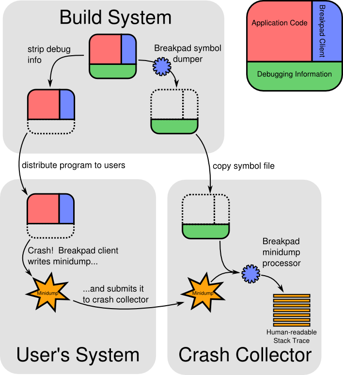

### 常见的异常信号（exception signals）
* SIGSEGV：
  * 当进程尝试访问未分配给自己的内存、或者访问受保护的内存区域时，会收到该信号。通常表示"Segmentation fault"，即段错误。
* SIGABRT：
  * 由调用 abort() 函数引起，一般表示进程自己请求终止。通常表示"Abort"，即终止信号。
* SIGFPE：
  * 浮点异常信号，当发生除以零或溢出等算术错误时会收到该信号。通常表示"Floating point exception"，即浮点异常。
* SIGILL：
  * 非法指令信号，表示进程执行了非法的机器指令。通常表示"Illegal instruction"，即非法指令。
* SIGBUS：
  * 总线错误信号，当进程访问未对齐的内存地址或者硬件故障时会收到该信号。通常表示"Bus error"，即总线错误。
* SIGTRAP：
  * 断点异常信号，通常由调试器用来在某些特定事件发生时中断进程。通常表示"Trace or breakpoint trap"，即断点异常。

##### Breakpad Demo
* [Google Breakpad for Android](https://chromium.googlesource.com/breakpad/breakpad/+/HEAD/README.ANDROID)
* [性能优化 (十三) 有了 breakpad , native 崩溃再也不怕了](https://juejin.cn/post/6844903944175484941)
* [YKCrash](https://github.com/yangkun19921001/YKCrash)
* [android-crash](https://github.com/yanbober/android-crash)
* [01 | 崩溃优化（上）：关于“崩溃”那些事儿](https://time.geekbang.org/column/article/70602)
* [BreakpadDemo](https://github.com/RookieApe/BreakpadDemo/tree/master)
* [Catching Exceptions and Printing Stack Traces for C on Windows, Linux, & Mac](https://spin.atomicobject.com/exceptions-stack-traces-c/) 
* [Google Breakpad 源码解析（二](https://juejin.cn/post/6991473315672129573)

### 不同平台的实现原理
> 默认情况下，当崩溃时breakpad会生成一个minidump文件，在不同平台上的实现机制不一样：
* 在windows平台上，使用微软提供的 SetUnhandledExceptionFilter() 方法来实现。
* 在OS X平台上，通过创建一个线程来监听 Mach Exception port 来实现。
* 在Linux平台上，通过设置一个信号处理器来监听 SIGILL SIGSEGV 等异常信号
### Breakpad 主要由三个部分组成
* Client，当端上发生崩溃时，会默认生成 minidump 文件。
* Symbol Dumper，这个工具用于生成 Breakpad 专属的符号表，要作用在带有调试信息原始库才行。
* Processor，这个工具通过读取 Client 生成的 minidump 文件，再去匹配 Symbol Dumper 生成的对应符号表，最后生成人类可读的 C/C++ 堆栈跟踪。

### Use:   xxx.dmp to txt
//格式
./minidump_stackwalk xxx.dmp >xxx.txt

//例子
./minidump_stackwalk /Users/devyk/Data/Project/sample/tempFile/nativeCrash.dmp >crashLog2.txt

### breakpad 概览

